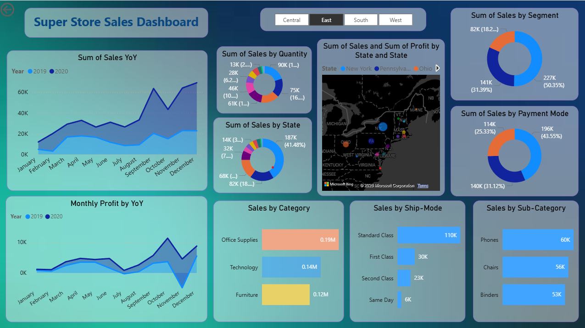
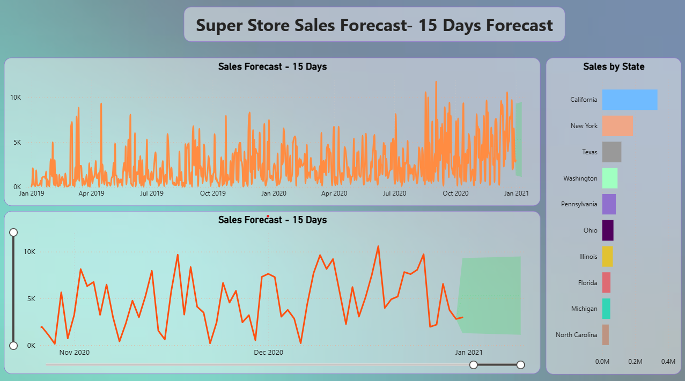

# Super Sales Dashboard - Power BI

## Project Overview

This project presents an interactive Power BI dashboard developed to analyze sales performance, profit trends, customer segments, and regional business insights. The dashboard uses DAX calculations, KPI metrics, forecasting analysis, and advanced data visualization techniques to support data-driven decision-making.

The project helps businesses monitor performance, identify profitable areas, and understand sales behavior through interactive reports and dashboards.

## Objectives of the Project

* Analyze overall sales and profit performance
* Identify high-performing regions and categories
* Track monthly sales and profit trends
* Perform sales forecasting for future planning
* Generate actionable business insights using visual analytics

## Tools & Technologies Used

* Power BI
* DAX (Data Analysis Expressions)
* Microsoft Excel
* Data Visualization
* Business Intelligence
* Forecast Analysis

## Dashboard Features

### Sales Performance Dashboard

* Year-over-Year Sales Analysis
* Monthly Profit Trend Analysis
* Sales by Category & Sub-Category
* Regional and State-wise Sales Insights
* Sales by Segment and Payment Mode
* Shipping Mode Analysis
* Interactive Slicers and Filters

### Forecast Dashboard

* 15-Day Sales Forecasting
* Historical Sales Trend Analysis
* Forecast Visualization
* State-wise Forecast Insights

## Key Performance Indicators (KPIs)

* Total Sales
* Total Profit
* Total Orders
* Profit Margin
* Average Sales Value

## Key Business Insights

* The West region generated the highest sales performance.
* Technology category contributed maximum profit.
* Discounts negatively affected profitability in some regions.
* Peak sales were observed during December.
* Standard Class shipping mode recorded the highest order volume.

## Skills Demonstrated

* Power BI Dashboard Development
* DAX Calculations & Measures
* Data Cleaning & Transformation
* Forecast Analysis
* KPI Reporting
* Data Visualization
* Business Intelligence
* Analytical Thinking

## Dataset Information

The dataset contains sales transaction data including:

* Order Details
* Customer Information
* Product Categories
* Regional Sales Data
* Profit and Quantity Metrics
* Shipping and Payment Details

## Business Use Case

This dashboard helps stakeholders:

* Monitor business performance
* Identify profitable products and regions
* Improve sales strategies
* Analyze customer purchasing behavior
* Support strategic business decisions using data insights

## Dashboard Screenshots

### Sales Dashboard

### Forecast Dashboard

## Conclusion

This project demonstrates practical business intelligence and Power BI dashboard development skills by converting raw sales data into meaningful business insights and interactive visual reports.

